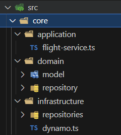
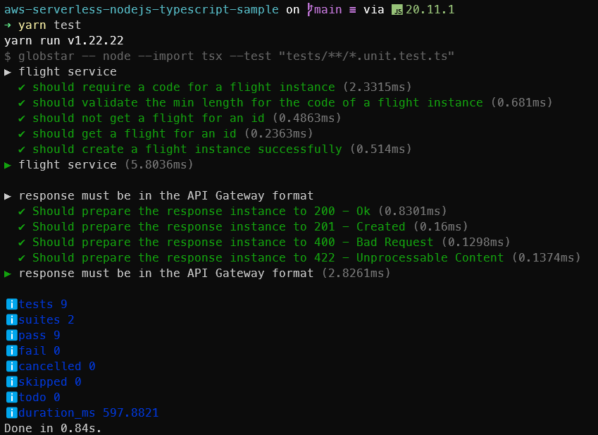

# AWS Serverless Node.Js Typescript Sample Project

This is a sample project using part of the stack I have used to work in my career. In this case, it expose a Cloud Native Rest API using AWS Services and focused on Serverless services. In order to archive it, you can notice it's build on the top of Serverless Framework which is a good tooling to make it easy to design, implement and maintain the infrastructure on the cloud side (AWS in this case).

### Stack

<table align=center border=1 width=100%>
  <tr>
    <td align=center valign=bottom width=25%> Node.Js</td>
    <td align=center valign=bottom width=25%> Typescript</td>
    <td align=center valign=bottom width=25%> Amazon Web Services</td>
    <td align=center valign=bottom width=25%> Serverless Framework</td>
  </tr>
  <tr>
    <td align=center valign=bottom> AWS API Gateway</td>
    <td align=center valign=bottom> AWS Lambda</td>
    <td align=center valign=bottom> AWS DynamoDB</td>
    <td align=center valign=bottom> AWS Cloud Formation</td>    
  </tr>
</table>

### Architecture

#### Rest API

The architecture consists in a serverless Rest API using Serverless Framework within the AWS as Cloud Provider. Through an `API Gateway`, `Lambdas` receive a request, process it and return a message to the `API Gateway` which responds to clients using the `HTTP` protocol. All the data is persisted into a `AWS DynamoDB` table which is defined on the serverless yml file. In the future, there will be a `Flight` notification via `SQS Queue` for each `Passenger` when it is open to _Check-in_ action.

  

#### Events

There is an in progress event series that for every `x` minutes in order to notify all the passengers that have a scheduled flight for the next `x` hours. Check the following diagram for the events.

  

#### Code Architecture

The code presents a [Layered Architecture](https://www.oreilly.com/library/view/software-architecture-patterns/9781491971437/ch01.html) using `Node.Js` and `Typescript` which will be transpiled to `Javascript` as the main language of the Node.Js runtime. It contains an `Domain Layer` where keep the domain of the project including Flight and Passengers and abstractions for storage and business rules. Then we have the `Infrastructure Layer` to maintain all the code related to I/O bound operations specially network calls such as cloud services implementations which includes database, queues, cloud services, external services, etc. And finally we have the `Application Layer` which is responsable to hold the business rules.

All the layers are in the low coupling to be able to future change the implementation so each component depends on abstractions instead concrete types. It also make our tests easy to simulate some behaviour we may want to test using Mocks. In the code, you can find it under the `./src/core` folder like the image bellow:

### Tests

There are a few unit tests in progress to cover the main business rules on the application layer of the project. It is implemented on the top of native `Node Test Runner` and to run it locally, you can run `yarn test` or `npm test`.

